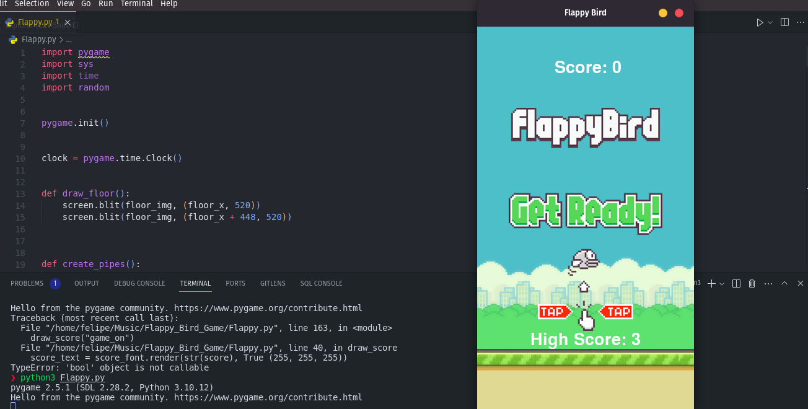

# Flappy Bird Game

## Introdução 
- O projeto surge com uma matéria comum da faculdade que visa trabalhar principalmente a **programação orientada à objetos** a linguagem foi a qual o estudante se sentisse mais *a vontade* para trabalhar, mas, o conselho da professora era trabalhar com o **python** 
- Uma implementação do famoso jogo __Flappy Bird__ em Python usando a biblioteca **Pygame**
- Em meus estudos pessoais estou focando bastante em __unittest__, o que para mim, é um ótimo amigo para testar os códigos antes de colocá-los diretamente em produção. 

## Funcionalidades
1. Renderização do chão e fundo do jogo.
2. Geração de canos aleatórios para o pássaro navegar.
3. Animação suave para o movimento do pássaro e dos canos.
4. Implementação de pontuação com atualização do score e high score.
5. Funcionalidade de reinício do jogo após o game over.

## Componentes Principais
- O código é composto por diversas classes que representam diferentes elementos do jogo, incluindo o pássaro, os canos, o chão e a tela do jogo. Cada classe possui métodos específicos que controlam o comportamento e a interação desses elementos. Além disso, variáveis de estado são utilizadas para acompanhar o progresso do jogo e o estado atual do pássaro.

